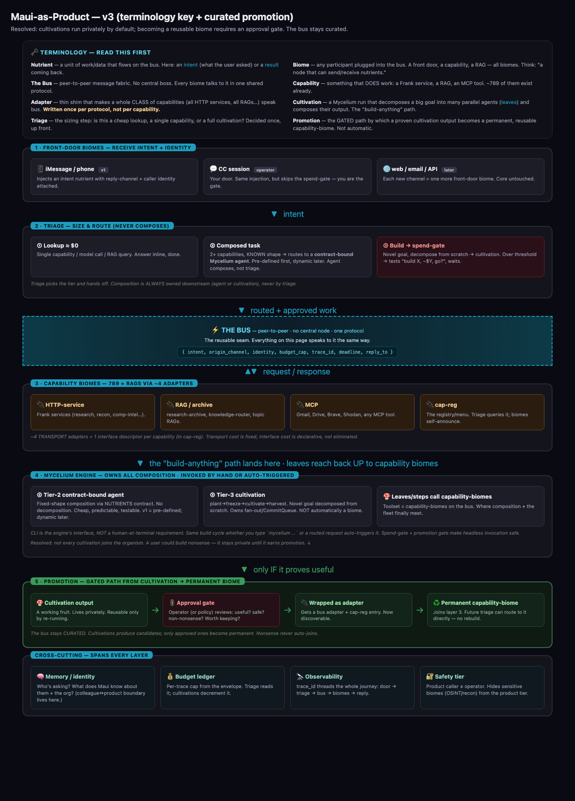
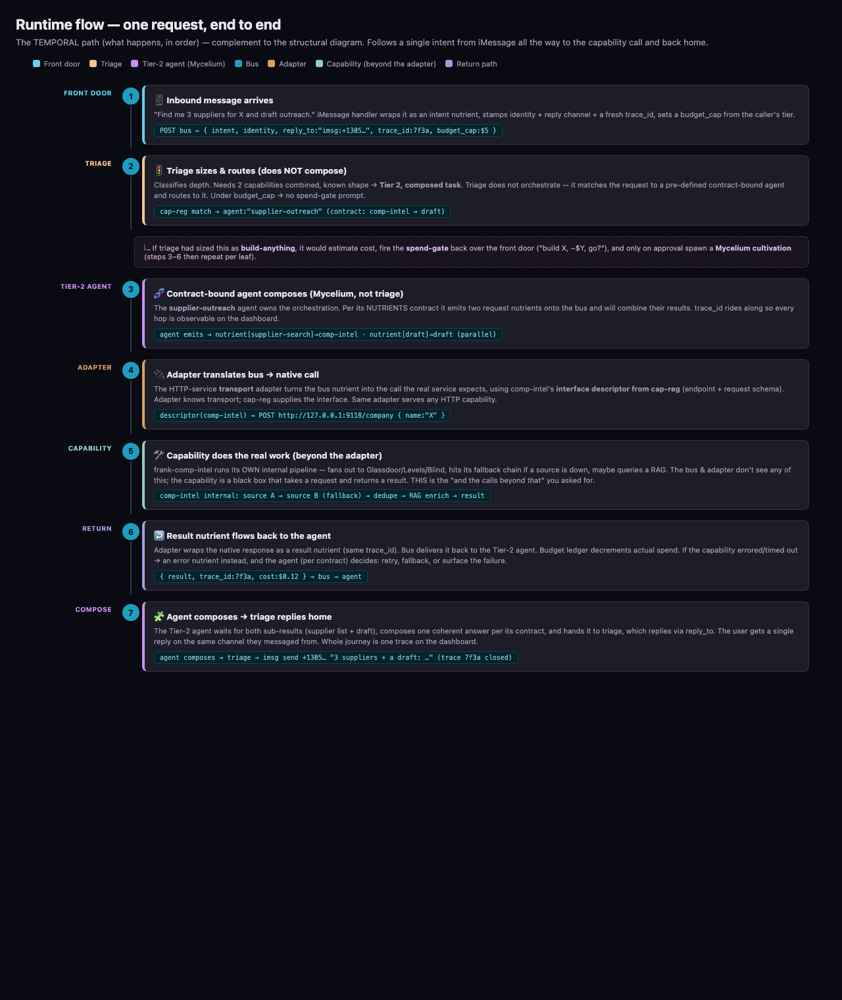

# Maui-as-Product: A Bus-Mediated Architecture for Composing Agentic Capabilities

> **Status:** Design white paper · v1 · 2026-05-29
> **Author:** SPY (Sean Young) + Cosmo
> **Scope:** How to turn a private agentic colleague (Maui) and an orchestration framework (Mycelium) into a distributable product, by composing a large existing capability fleet over a single message bus — without losing CLI-level control and without letting the system become a junk drawer.

---

## 1. Executive summary

We have three assets that today do not know about each other:

1. **Mycelium** — a language-agnostic, patent-pending orchestration framework. It knows how to decompose a goal into many parallel agents (*leaves*) and compose their output. This is the reusable orchestration grammar.
2. **The Frank/Maui capability fleet** — ~789 registered capabilities plus a large RAG/research-archive layer. These know how to *do* specific things. They are capabilities, not orchestration.
3. **Maui's front doors** — iMessage and phone today; web/email/API later. These know how to *receive intent*. They are transport.

The thesis of this paper: **a single message bus is the seam that lets all three compose without coupling them.** If every capability, every RAG, every front door, and every orchestration run speaks to the same peer-to-peer bus using one protocol, then integration stops being an N-by-N problem.

Be precise about what collapses and what does not. Integration has two parts: **transport** (how you reach a thing — HTTP vs MCP vs RAG-query) and **interface** (where it lives, what request shape it expects, what it returns). The bus collapses the *transport* cost to a small, fixed set of **transport adapters** — roughly four (HTTP service, RAG/archive, MCP, registry). It does **not** make the *interface* cost vanish: each capability's endpoint, request schema, and result shape still has to be described somewhere. That description lives as a **per-capability interface descriptor in cap-reg** (the registry), authored once per capability — declaratively, not as bespoke integration code.

So the honest claim is: **~4 transport adapters + one declarative interface descriptor per capability in cap-reg.** The win is real — interface facts become uniform, declarative registry data instead of N hand-written integration modules, and any capability that already has a descriptor is callable for free — but the per-capability cost moves into cap-reg rather than disappearing. Any implementation plan must budget for authoring/maintaining those descriptors.

Two principles keep the system honest:

- **Mycelium is the orchestration engine, above the bus — invokable two ways.** A cultivation is an orchestrator that *uses* the bus as a client and is **not** automatically a biome. What is load-bearing is the *engine* (deterministic fan-out, CommitQueue, dry-run, spend-cap, audit trail), **not** a human at a terminal. The same engine is invoked whether the operator runs `mycelium …` by hand or a routed request triggers it programmatically. The CLI is one front door onto the engine; the product is another. The gates (spend-gate, promotion) are what make auto-triggered, headless invocation safe.
- **The bus stays curated.** Cultivations *produce candidates* for new permanent capabilities, but joining the organism requires an explicit **promotion gate** (manual to start, policy-driven later). Nonsense a user builds never auto-joins.

The first product surface is iMessage + phone. That is just the first *front-door biome* — not a special case. Everything else in this paper is the machinery that makes adding the second and third front door cost almost nothing.

---

## 2. Terminology

This paper uses Mycelium's biological vocabulary. Names are not load-bearing — read the seams, not the labels — but here is the working glossary.

| Term | Meaning |
|---|---|
| **Nutrient** | A unit of work or data that flows on the bus. In practice: an *intent* (what a user asked) travelling in, or a *result* travelling back. |
| **Biome** | Any participant plugged into the bus. A front door, a capability, a RAG — all biomes. Mental model: "a node that can send and receive nutrients." |
| **The Bus** | A peer-to-peer message fabric. No central boss. Every biome speaks to it in one shared protocol. (Today: BIOME BUS, port 9450. The bus concept is integrated later in the build sequence; this paper designs forward-compatible.) |
| **Capability** | Something that *does* work: a Frank service, a RAG, an MCP tool. ~789 exist already. |
| **Transport adapter** | A thin shim that makes an entire *class* of capabilities (all HTTP services, all RAGs, all MCP tools) reachable over the bus. Written **once per protocol**, not once per capability. Handles *transport* only — see *Interface descriptor*. ~4 of them. |
| **Interface descriptor** | Per-capability registry data (endpoint, request schema, result shape) held in cap-reg. Authored **once per capability**, declaratively. The transport adapter + the descriptor together make a capability callable. The reusability is "~4 adapters + 1 descriptor per capability" — transport cost is fixed; interface cost is real but declarative (see §1, §3.4). |
| **Cultivation** | A Mycelium run that decomposes a *novel* goal from scratch into many parallel agents (leaves) and composes their output. The "build-anything" path — **Tier 3**. |
| **Composed task** | **Tier 2.** A request needing several capabilities combined in a *known* shape — handled by a pre-defined, contract-bound Mycelium agent (no goal decomposition). The "middle weight" between a single lookup and a full cultivation. |
| **Triage** | The sizing-and-routing step. Runs once, up front. Picks a **tier** — Tier 1 lookup (single) · Tier 2 composed task · Tier 3 cultivation — and **routes** to it. Triage **never composes**; composition is always owned downstream by a contract-bound agent or a cultivation. |
| **Promotion** | The *gated* path by which a proven cultivation output becomes a permanent, reusable capability-biome. Never automatic. |

---

## 3. Structural view — the organism

The structural view answers: *where do things live, and how do they relate?*



> (Diagrams are reproduced in §3.1–§3.6 as text so the paper is self-contained without the rendered image.)

### 3.1 Layer 1 — Front-door biomes (receive intent + identity)

Front doors receive intent and nothing more. They do **not** decide what to do. Each one wraps an inbound message as an intent nutrient and attaches:

- a **reply channel** (so the answer knows how to get home),
- a **caller identity** (so memory and the safety tier know who is asking).

- **iMessage / phone** — v1. The first product surface.
- **CC session** — the operator door. Same injection, but it *skips the spend-gate* because the operator is the gate.
- **web / email / API** — later. Each new channel is one more front-door biome. The core is untouched when you add one.

### 3.2 Layer 2 — Triage (classify depth, route — never compose)

Triage **sizes and routes**, and it runs **once** per request. Critically, triage does **not** itself orchestrate or compose multiple capability calls — composition is always owned by something downstream (a contract-bound agent or a cultivation). Triage's only job is to pick the right tier and hand off. It sizes a request into one of **three tiers**:

- **Tier 1 — Lookup (≈ $0).** One model call or one RAG query, or a dispatch to a *single* capability-biome. Triage routes it and the answer comes straight back. No composition.
- **Tier 2 — Composed task.** A request that needs *several* capability-biomes combined (sequence or parallel) but is **not** a novel build. Triage routes it to a **contract-bound Mycelium agent** — a fixed-shape composition (call these capabilities, compose this way) defined ahead of time with a NUTRIENTS contract. The agent owns the orchestration; triage just selected it. (See §3.5 for why this is Mycelium, not triage, doing the work; and §6.2 for the pre-defined→dynamic evolution.)
- **Tier 3 — Build-anything.** A novel goal that must be decomposed from scratch → a full Mycelium cultivation. Expensive; gated (see §3.7 and §6).

This three-tier split resolves the "middle weight" directly: **not every multi-capability request is a cultivation.** A composed task (Tier 2) is cheaper and more predictable than a full build because its shape is known in advance — it is a bounded, contract-defined agent, not an open-ended decomposition.

Mis-sizing is the expensive failure mode. Routing "what's the weather" to a cultivation burns real money; routing "build me a CRM" to a single capability produces garbage. Triage is where that risk is concentrated and controlled — but note that *picking the right capability/agent* depends on resolving the request against cap-reg, which is itself a non-trivial reliability problem (see §6.7).

### 3.3 The bus (the reusable seam)

A peer-to-peer message fabric. No central node. Every box in this paper speaks to it the same way. The nutrient envelope is the real contract to freeze:

```
{ intent, origin_channel, identity, budget_cap, trace_id, deadline, reply_to }
```

Everything downstream — routing, observability, budget enforcement, the return path — is derived from this envelope.

### 3.4 Layer 3 — Capability biomes (the 789 + RAGs, via ~4 adapters)

This is where the reusability claim lives — stated precisely (see §1). We write one **transport adapter** per protocol class, and pair it with a **per-capability interface descriptor** held in cap-reg:

- **HTTP-service adapter** — speaks HTTP to any Frank service (research, recon, comp-intel, …). The *which endpoint, what request shape* comes from that service's cap-reg descriptor.
- **RAG / archive adapter** — speaks the query protocol to research-archive (8975), knowledge-router (9003), topic RAGs.
- **MCP adapter** — speaks MCP to any MCP tool (Gmail, Drive, Brave, Shodan, …).
- **cap-reg** — the registry (9172) holds the **interface descriptors** (endpoint, request schema, result shape) *and* is the menu triage resolves needs against. Biomes self-announce; descriptors are authored once per capability.

**~4 transport adapters + one declarative descriptor per capability** — not 789 hand-written integrations. The transport cost is fixed and small; the interface cost is real but declarative and lives in the registry. This is the concrete, honest meaning of "think bigger / what's the reusability."

### 3.5 Layer 4 — Mycelium orchestration (runs *above* the bus, private by default)

**Mycelium owns all composition.** Whenever a request needs more than one capability combined, the orchestration is owned by Mycelium — never by triage. Mycelium runs *above* the bus as a client of it, owns its own fan-out, parallelism, and CommitQueue, and is **not** automatically a biome.

The CLI is the *engine's interface, not a human-in-the-loop requirement.* The build cycle (plant → freeze → cultivate → harvest) is executed identically whether the operator invokes it by hand at a terminal **or** a routed request auto-triggers it programmatically. The operator's terminal keeps the full manual control surface (dry-run, concurrency, spend-cap, skip/resume); the product gets the same surface with the gates wired to the front door instead of a prompt. Auto-triggered invocation is made safe by the spend-gate (before a costly build runs) and the promotion gate (before output joins the organism) — not by requiring a person to type the command.

Mycelium serves the two composing tiers from §3.2:

- **Tier 2 — contract-bound agent (bounded composition).** A fixed-shape Mycelium agent defined ahead of time via a NUTRIENTS contract: a known set of capability calls combined in a known way. No goal decomposition — the shape is authored, not discovered. This is the cheap, predictable middle weight triage routes most multi-capability requests to. **v1 ships only pre-defined contract-bound agents** (testable, cost-predictable); dynamic on-the-fly assembly is deferred to a later capability (§6.2), mirroring the manual→policy promotion philosophy.
- **Tier 3 — cultivation (open-ended composition).** A novel goal decomposed from scratch into HYPHAE and leaves. Gated by the spend-gate.

In both tiers, the **leaves** (or agent steps) reach *back up* to capability-biomes on the bus as their toolset. This is the moment composition and the fleet finally meet: a leaf doing real work can call comp-intel, a RAG, or Gmail through the same bus everything else uses. Because Mycelium runs above the bus, its internals stay private and the CLI-level control we depend on is preserved intact.

The rationale for *not* making every cultivation a biome: a user could build nonsense. We do not want arbitrary user-built artifacts auto-joining the organism. They stay private until they earn promotion. (Note: a pre-defined Tier-2 contract-bound agent is the *opposite* case — it is authored and trusted up front, so it can be a first-class, promotable unit from day one.)

### 3.6 Layer 5 — Promotion (gated path: cultivation → permanent biome)

This is how the organism grows itself over time without becoming a junk drawer:

```
Cultivation output  →  Approval gate  →  Wrapped as adapter  →  Permanent capability-biome
   (works, but        (useful? safe?      (gets a bus adapter      (joins Layer 3; future
    private)           non-nonsense?)       + cap-reg entry)         triage routes to it directly)
```

- **Start: manual approval.** The operator reviews each candidate: is it useful, safe, and worth keeping?
- **Later: policy auto-approve.** Rules auto-promote safe categories; the rest still escalate to manual.

The payoff: every approved promotion makes future triage smarter. Instead of rebuilding a capability via cultivation each time, triage can route directly to the now-permanent biome. The organism accretes proven capability and never accretes junk.

### 3.7 Cross-cutting concerns (span every layer)

Four concerns thread through the whole system. Notably, because they are uniform and carry the `trace_id`, **they are the natural data source for an operator dashboard** — one coherent story per request, from door to reply.

- **Memory / identity** — who is the caller, and what does Maui remember about them and their org? The colleague↔product boundary lives here (deep-dive deferred).
- **Budget ledger** — per-trace cap drawn from the envelope. Triage reads it; cultivations and capability calls decrement it.
- **Observability** — `trace_id` threads the entire journey: door → triage → bus → biomes → reply. This is what the dashboard renders.
- **Safety tier** — a product caller is not the operator. This gates which capability-biomes are even *visible* to a given tier (e.g. OSINT/recon hidden from the product tier). This is the home of the colleague↔product separation; a dedicated deep-dive is deferred.

---

## 4. Runtime view — one request, end to end

The structural view shows where things live. The runtime view shows *what happens, in order*. Worked example: **"Find me 3 suppliers for X and draft outreach."**



| # | Lane | What happens | Wire |
|---|---|---|---|
| 1 | Front door | iMessage handler wraps the message as an intent nutrient; stamps identity, reply channel, fresh `trace_id`, and a `budget_cap` from the caller's tier. | `POST bus ← { intent, identity, reply_to:"imsg:+1305…", trace_id:7f3a, budget_cap:$5 }` |
| 2 | Triage | Sizes it. Needs 2 capabilities (supplier search + draft) combined, but not a novel build → **Tier 2, composed task**. Triage does **not** compose — it matches the request to a pre-defined contract-bound agent and routes to it. Under cap → no spend-gate. | `cap-reg match → agent:"supplier-outreach" (contract: comp-intel → draft)` |
| 3 | Tier-2 agent (Mycelium) | The contract-bound `supplier-outreach` agent owns the composition. Per its NUTRIENTS contract it issues two request nutrients to the bus and will combine their results. `trace_id` rides along. | `agent emits: nutrient[supplier-search] → comp-intel · nutrient[draft] → draft (parallel)` |
| 4 | Adapter | The HTTP-service adapter translates a bus nutrient into the call the real service expects, using comp-intel's **interface descriptor from cap-reg** (endpoint + request schema). The adapter knows *transport*; cap-reg supplies the *interface*. | `descriptor(comp-intel) ⇒ POST http://127.0.0.1:9118/company { name:"X" }` |
| 5 | **Capability (beyond the adapter)** | comp-intel runs its **own** internal pipeline — fans out to Glassdoor/Levels/Blind, uses its fallback chain if a source is down, maybe enriches from a RAG. The bus and adapter never see any of this. The capability is a black box: request in, result out. | `comp-intel internal: source A → source B (fallback) → dedupe → RAG enrich → result` |
| 6 | Return | Adapter wraps the native response as a result nutrient (same `trace_id`). Bus delivers it back to the Tier-2 agent. Budget ledger decrements actual spend. On error/timeout → an *error nutrient* instead, and the agent (per contract) decides: retry, fallback, or surface the failure. | `{ result, trace_id:7f3a, cost:$0.12 } → bus → agent` |
| 7 | Return | The Tier-2 agent waits for both sub-results, composes one coherent answer per its contract, and hands it back to triage, which replies via `reply_to`. The user gets a single reply on the channel they messaged from. The whole journey is one trace on the dashboard. | `imsg send +1305… "Here are 3 suppliers + a draft: …" (trace 7f3a closed)` |

**Branch — if triage had sized this as Tier 3 (build-anything):** it would estimate cost, fire the **spend-gate** back over the front door ("build X, ~$Y, go?"), and only on approval spawn a Mycelium cultivation that decomposes the goal from scratch. Steps 4–6 then repeat per leaf, with leaves calling capability-biomes exactly as shown.

The key insight of the runtime view: **the transport adapter is a thin translation boundary driven by cap-reg's interface descriptor; the capability behind it is an opaque pipeline of arbitrary depth.** The adapter supplies *transport*; the descriptor supplies the *interface* (endpoint, request schema); together they make the call. The bus does not care how comp-intel finds suppliers — it only cares that comp-intel takes a request nutrient and returns a result nutrient. This encapsulation is what lets transport stay fixed (~4 adapters) even though each capability still needs its own descriptor.

---

## 5. Why this is the reusable move

- **Transport cost collapses from O(N) to O(protocols); interface cost stays O(N) but goes declarative.** Adding the 790th capability needs no new integration *code* if it speaks a protocol we already adapt — but it still needs its interface descriptor authored in cap-reg. The win is that per-capability work shrinks from a bespoke integration module to one registry entry. Adding the second front door *is* free (one more biome). Adding a new orchestration mode reuses the same capability layer.
- **Mycelium and the fleet finally compose.** Today they are siloed: cultivations build apps; the fleet answers research. With the bus, a cultivation leaf can call any capability, and a capability result can feed a cultivation. They become one system.
- **Observability is uniform and free.** Because everything carries `trace_id` through one envelope, the dashboard is a read over the bus, not a bespoke integration per surface.
- **The organism grows safely.** The promotion gate means proven work accretes as permanent capability while junk stays quarantined as private cultivation output.
- **Front doors are interchangeable.** iMessage today, web/email/API later — each is one biome. The product is not "an iMessage bot"; it is a bus with a swappable mouth.

---

## 6. Open seams (explicitly deferred, not forgotten)

These are real and need their own treatment before or during build. Listed here so they are not silently dropped.

1. **Failure / timeout paths.** *Resolved (interface) — see [failure handoff contract](./mycelium-failure-handoff-contract.md).* Three handling levels (capability-internal fallback, unchanged · transport/bus · semantic/orchestrator); bus enforces the envelope `deadline` (authoritative) while the capability self-budgets within it; five-class failure taxonomy (`exhausted`/`deadline_hit`/`unreachable`/`bad_request`/`degraded`) carried on a full `ErrorNutrient` schema. **Recovery *policy* deferred** — fallback-biome *selection* waits on §6.7 (cap-reg resolution); partial-result *composition* waits on §6.2 (Tier-2 mechanics). The interface those policies consume is locked.
2. **Tier 2 — pre-defined → dynamic composed tasks.** *Resolved in structure:* multi-capability requests are Tier-2 composed tasks owned by a contract-bound Mycelium agent, not triage and not (necessarily) a cultivation (§3.2, §3.5). **v1 ships only pre-defined contract-bound agents.** The *remaining* open question is narrower: when does a request justify *dynamic* on-the-fly composition (no pre-authored contract), and where is the line between a dynamic Tier-2 assembly and a true Tier-3 cultivation? Dynamic assembly is deferred until the pre-defined pattern is proven, mirroring manual→policy promotion.
3. **Async / long-running replies.** *Resolved (interface) — see [async reply contract](./mycelium-async-reply-contract.md).* One reply path; sync is the degenerate sub-second case. The envelope's `trace_id → reply_to → origin_channel → identity` tuple routes every reply home. Channel is **progress-capable** via a `kind` field (`progress`/`confirm_required`/`result`) — the spend-gate is just the first `confirm_required` nutrient, not a separate mechanism; only the terminal `result` is authoritative and settles the ledger. New `relates_to` field added for inbound correlation. **Persistence + correlation policy deferred** to §6.4: this contract requires the routing tuple be *resolvable at delivery*, but the durable store that survives a restart — and the interrupt/queue/ignore policy for a `relates_to` intent — is statefulness.
4. **Statefulness / follow-ups.** "Make it shorter" referring to the previous answer. Does the intent nutrient carry conversation context? Where does conversational state live — front door, memory layer, or trace? **Now the convergence point: both the failure contract (§6.1) and the async-reply contract (§6.3) hand off here.** It owns the durable `trace_id → reply_to → identity` store that lets a reply survive a process restart, and the inbound-correlation policy (interrupt/queue/ignore/fold) for a `relates_to` intent. Next deployment-blocking seam to design.
5. **Safety tier deep-dive.** The colleague↔product boundary. Which capability-biomes are visible to which tier, how identity maps to tier, and how the operator's full-access door coexists with a constrained product door. (Acknowledged as the right home in §3.7; deep-dive deferred by decision.)
6. **The "cultivation as biome" question, revisited.** Resolved *for now* as "no, private by default, promotion-gated." If recursion/observability pressure later argues for cultivations-as-biomes, the promotion gate is the natural place that decision would flip — a promoted cultivation could itself register as a recurring biome.
7. **Intent → capability resolution is itself a reliability problem (load-bearing assumption).** The whole design assumes triage can reliably resolve a natural-language need to the right capability/agent via cap-reg (e.g. `need="supplier-search" → comp-intel`). In this environment that is *not* a solved lookup: the capability-discovery protocol observed that ~50% of capabilities go undiscovered when the cap-reg step is skipped, and keyword enrichment alone only improved discovery by ~1.4pp. Routing quality — not transport — is where a large share of real-world mis-behavior will live. This must be designed (and measured) explicitly: how needs map to descriptors, how ambiguity is handled, and what the fallback is when resolution is low-confidence. Named here as a load-bearing assumption, not an incidental detail.
8. **The spend-gate gates cost, not harm.** Auto-triggered headless invocation (§3.5) is made *cost-safe* by the spend-gate, but a cultivation can do non-cost damage (wrong, misleading, or destructive output) before the promotion gate ever sees it. A headless-autonomy story needs a harm/safety check distinct from the cost check — what a leaf is allowed to *do* (write where? send to whom?), not just what it may *spend*. Logged here; design deferred.

---

## 7. Decisions locked in this session

- **Bus is the universal seam** (forward-compatible; bus concept integrated later in build sequence, design now).
- **The reusability is ~4 transport adapters + a per-capability interface descriptor in cap-reg** — not "789 integrations become free." Interface cost moves to the registry; it does not vanish.
- **Names are placeholders** — the seams are load-bearing, the biological vocabulary is not.
- **Triage sizes and routes; it never composes.** Three tiers: Lookup (single) · Composed task (Tier 2) · Build-anything (Tier 3).
- **All composition is owned by Mycelium**, above the bus, private by default. A cultivation is not automatically a biome.
- **The CLI is the engine's interface, not a human-in-the-loop requirement.** The build cycle is invoked identically by an operator typing `mycelium …` or by a routed request triggering it programmatically. Auto-triggered headless invocation is made safe by the spend-gate + promotion gate.
- **Tier 2 = contract-bound Mycelium agent.** Pre-defined first (v1), dynamic on-the-fly assembly later — mirroring manual→policy promotion.
- **Promotion is gated: manual approval to start, policy auto-approve later.**
- **Cross-cutting concerns double as the dashboard data source.**
- **Safety tier is the colleague↔product boundary** (deep-dive deferred).
- **Intent→capability resolution via cap-reg is a load-bearing reliability assumption**, not a given — must be designed and measured (§6.7).
- **First front door is iMessage + phone**, treated as one biome among future many.

---

## 8. Suggested next steps (not yet decided)

1. Pick **one** open seam from §6 to design next — failure/timeout is the strongest candidate because it blocks any real deployment.
2. Decide the **build sequence**: does the bus land first, or do we ship the iMessage→triage→single-capability happy path against the existing fleet *without* the full bus, then retrofit the bus? (Forward-compatible design makes the latter viable.)
3. Decide whether the first build is **dogfooded as a Mycelium cultivation** (per the established operator-authored-hyphae pattern) or implemented directly.

---

*This document is a design artifact, not an implementation plan. The next step in the workflow is to select a scope and produce an implementation plan via the writing-plans process.*
